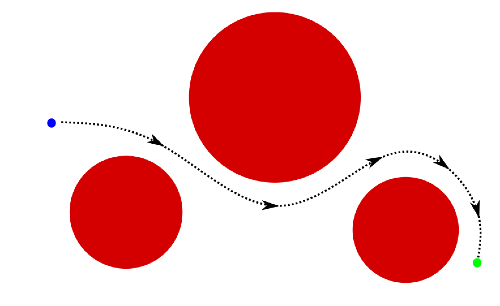
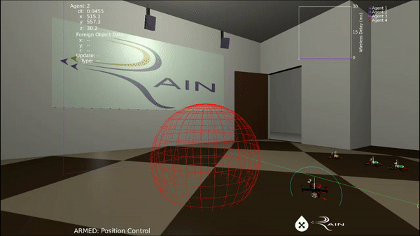
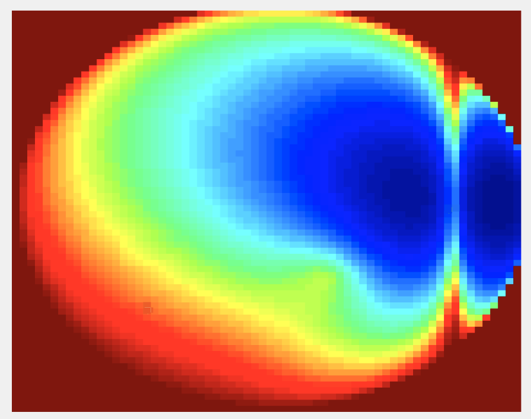

# Quadrotor-Trajectory-Navigation
Implementation of a trajectory generation algorithm in a quadrotor simulation (I built everything)

# Introduction
Hello. This is my project for my internship at the Robotics, Aerospace, and Information Networks (RAIN) lab at the University of Washington. 

# Results
I built an accurate quadrotor simulation and a trajectory generation algorithm which is able to autonomously navigate a quadrotor through an obstacle-populated environment. I implemented this script on a live quadrotor platform in C. Overall, the algorithm is able to quickly generate a safe and optimal trajectory that allows the quadrotor to fly at speeds up to 3 meters per second.

# Navigation Functions
The algorithm utilized navigation functions as a method for trajectory generation. Navigation functions map quadrotor positions to costs, where favorable positions have low costs and unfavorable positions have high costs. For all other states, the navigation function varies smoothly. The algorithm used is able to safely and quickly navigate a live quadrotor through an obstacle-populated environment in real time. Navigation functions are also quick to compute as they only require the centers and radii of the spheres which encapsulate the obstacles. This algorithm can also generalize to non-spherical obstacles and environments involving multiple agents. 

# Quadrotor Simulation
Quad.m is the quadrotor class. This class provides an accurate simulation of a quadrotor flying around, including discretized controllers and sensors. I found that there was not a whole lot of difference between real life and simulation.

# Algorithm
The algorithm is located in RoussosTrajectory.m. This function is mainly an optimizer that converges to the global minimum of a cost function provided by RoussosNavigationFunction.m. 